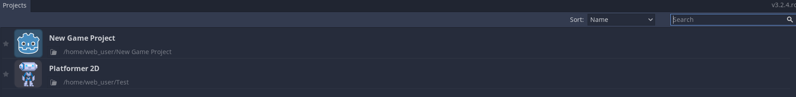
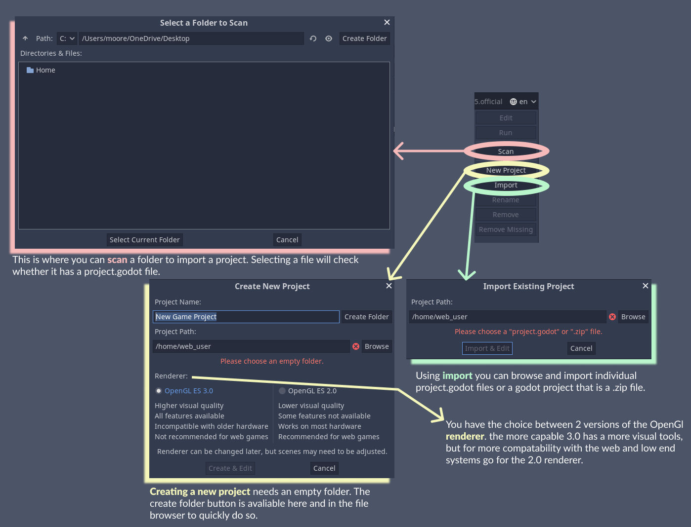

The Project Manager
===================

This is the Godot project manager!
Below is where you can select any currently loaded projects.

.. raw:: html

  
  </img>

**The button panel on the right is used to import, create, or manipulate a project**.
The only buttons available when opening the manager for the first time are for *loading projects*, the rest are used to manipulate a project
(*edit*, *run*, *rename*, *remove*, *remove missing*)

